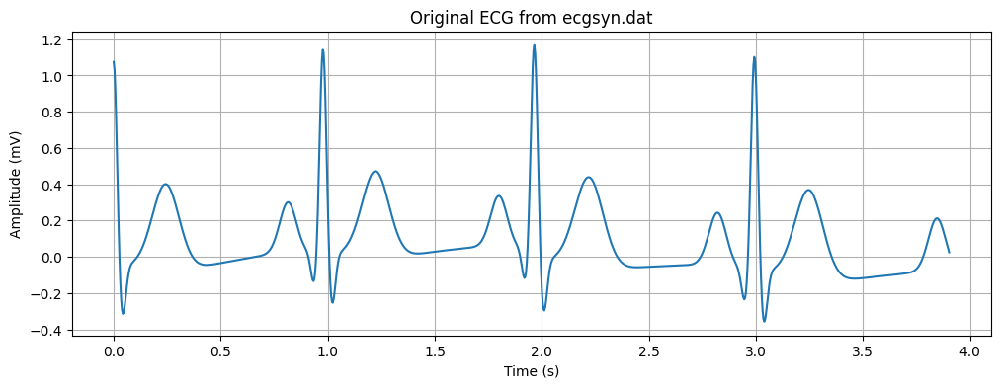
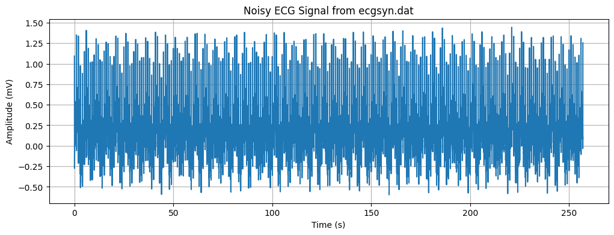
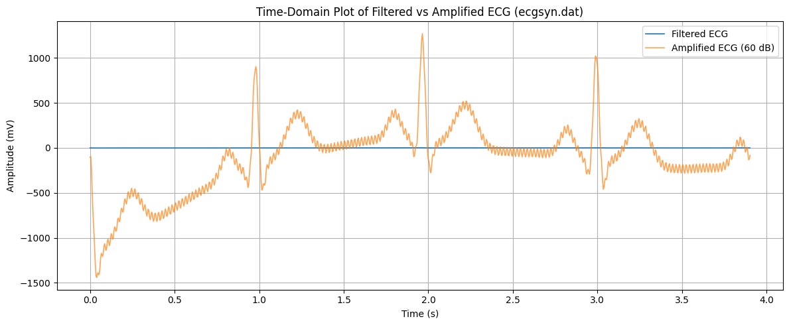
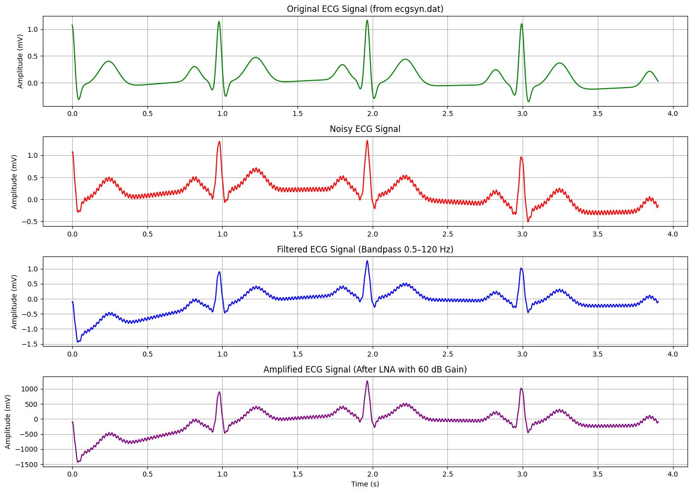
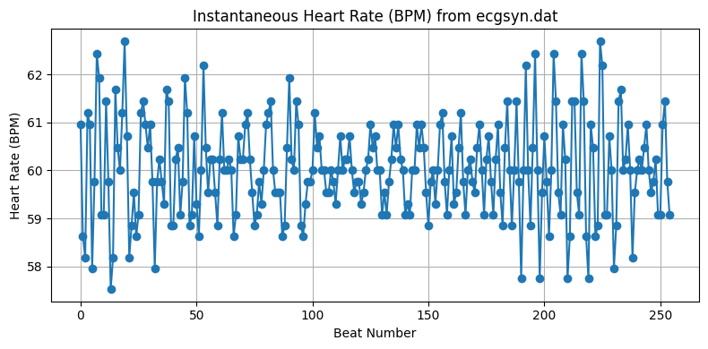

# 🫀 RealBeat Lab: From Raw Signals to Real Insights
**RealBeat Lab** is a hands-on notebook project focused on working with **real ECG signal data** from `ecgsyn.dat`. We take the raw heartbeat signal, add real-world noise, clean it up, amplify it, and detect peaks — just like a real ECG monitoring system would.

If you've ever wondered how hospitals extract meaningful heartbeats from noisy signals, this project is your lab manual 💡💓

---

## 🔍 What This Project Does

### ✅ Load Real ECG Data  
From a `.dat` file that contains time and ECG signal readings.

### 💥 Simulate Real-World Noise  
- 🧍 Motion artifacts (baseline wander)  
- 🔌 Powerline interference (50Hz)  
- 🌀 Flicker noise (random low-frequency noise)  

### 🧼 Clean Up the Signal  
Apply a **bandpass filter** to remove unwanted frequencies and keep only what's relevant for the human heartbeat.

### 🔊 Amplify It  
Simulate a **60 dB LNA amplifier**, boosting weak signals for clearer reading.

### ❤️ Detect the Heartbeats  
Use **peak detection** to identify R-peaks (the big "thumps" in a heartbeat signal).

### 📊 Visualize Everything  
Step-by-step plots showing:
- Original signal
- Noisy signal
- Filtered signal
- Amplified signal
- Detected heartbeats

---

## 🧠 Why This Is Useful

This notebook is a **mini simulation lab** for:
- Students learning biomedical signal processing  
- AI/ML engineers exploring ECG data preprocessing  
- Anyone curious about how a real heart monitor works  

---

## 🛠 Requirements

- Python 3.8 or later  
- NumPy  
- Matplotlib  
- SciPy

You can install them with your favorite method (`pip`, `conda`, etc.).

---
## 🧪 Sample Output

ECGSYN.DAT ECG: ✅


Noisy ECG: 😵


Filtered ECG: 🧼


Amplified ECG: 🔊


Heartbeats Detected: ❤️❤️❤️

 ---

## 📎 File Structure

```text
📁 RealBeat-Lab/
├── ECGSYN.DAT_SIMULATION.ipynb
├── ecgsyn.dat
├── README.md

---

## 🧪 Sample Output
(Add screenshots or waveform images here)

Clean ECG: ✅

Noisy ECG: 😵

Filtered ECG: 🧼

Amplified ECG: 🔊

Heartbeats Detected: ❤️❤️❤️